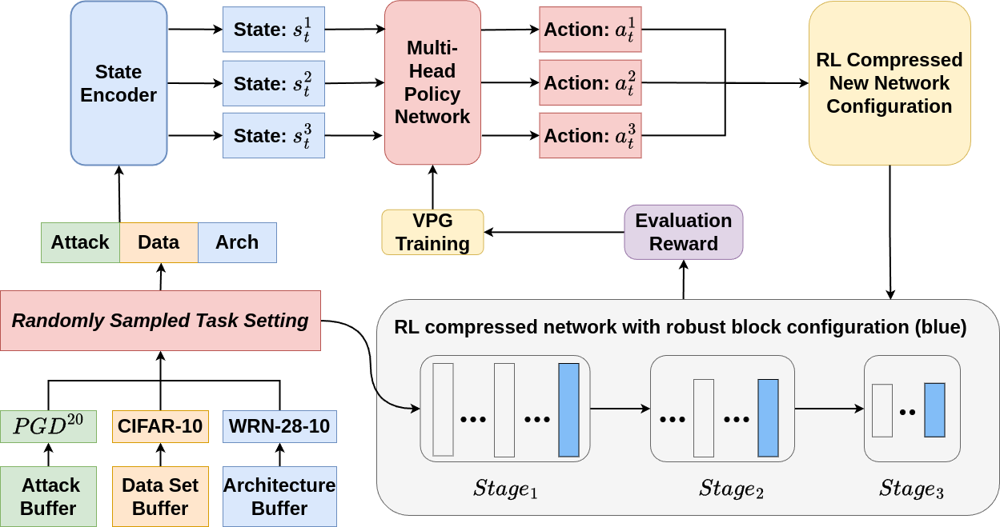
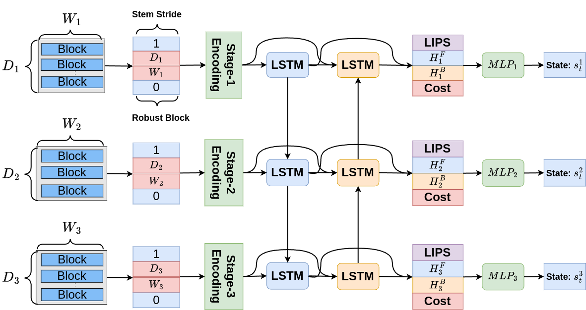
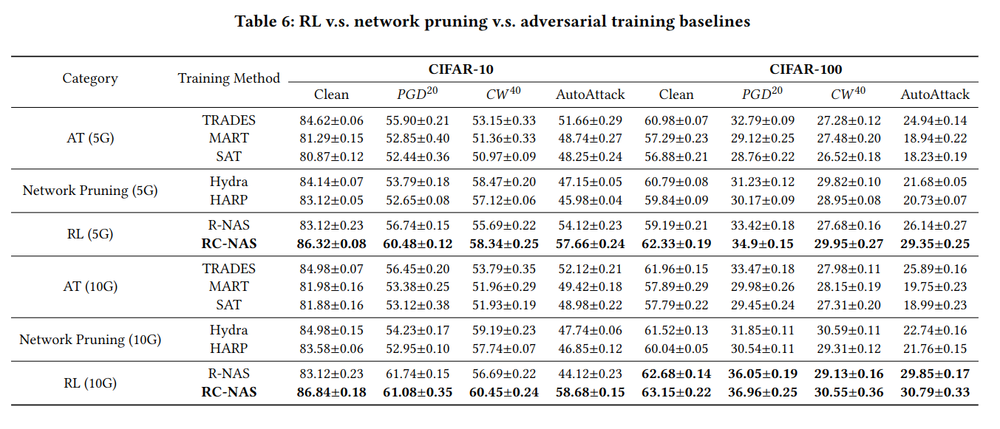
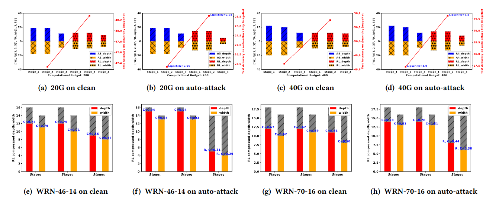

# Reinforced Compressive Neural Architecture Search for Versatile Adversarial Robustness


## Introduction

Prior neural architecture search (NAS) for adversarial robustness
works have discovered that a lightweight and adversarially ro-
bust neural network architecture could exist in a non-robust large
teacher network, generally disclosed by heuristic rules through sta-
tistical analysis and neural architecture search. However, heuristic
methods cannot uniformly handle different adversarial attacks and
"teacher" network capacity. To solve this challenge, we propose
a Reinforced Compressive Neural Architecture Search (RC-NAS)
for Versatile Adversarial Robustness. Specifically, we define task
settings that compose datasets, adversarial attacks, and teacher
network information. Given diverse tasks, we conduct a novel dual-
level training paradigm to push the model to achieve the best robust
accuracy for the target task setting, and also retain the potential
to fit into other versatile tasks easily. Experiments show that our
framework could achieve adaptive compression towards different
initial teacher networks, datasets, and adversarial attacks, result-
ing in a more lightweight and adversarially robust architecture
compared to baselines adopting heuristic rules. We also provide
a theoretical analysis to explain why the RL-guided adversarial
architectural search helps adversarial robustness over standard
adversarial training methods.

Here we show the RL framework training and state encoder diagram of our RL agent for illustration.





## Installation


Please install the neccessary library following requirements.txt in the project folder.


## Meta RL Training

```
python adv-main_dist.py

```

## Downstream RL training

```
python adv-main_dist.py --task WRN-A1.yaml --M 5

```


## Inference


``` 

python test_dist.py

```


## Dataset Website

+ [CIFAR-10,100](https://www.cs.toronto.edu/~kriz/cifar.html#:~:text=The%20CIFAR%2D10%20dataset,batch%2C%20each%20with%2010000%20images.)

+ [Tiny_ImageNet](https://www.kaggle.com/c/tiny-imagenet)


## RL searched sub-network configuration

+ configs/CIFAR10/RL_5g/10g/20g/40g

+ configs/CIFAR100/RL_5g/10g/20g/40g


## Performance Comparison



## RL Searched Network Topology Analysis
